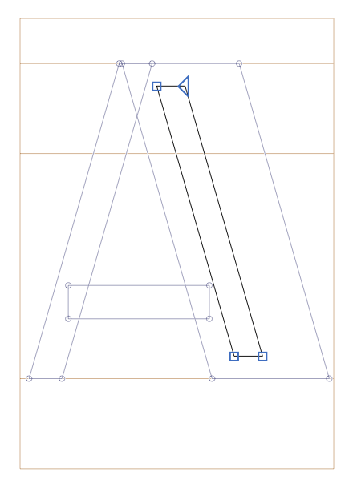
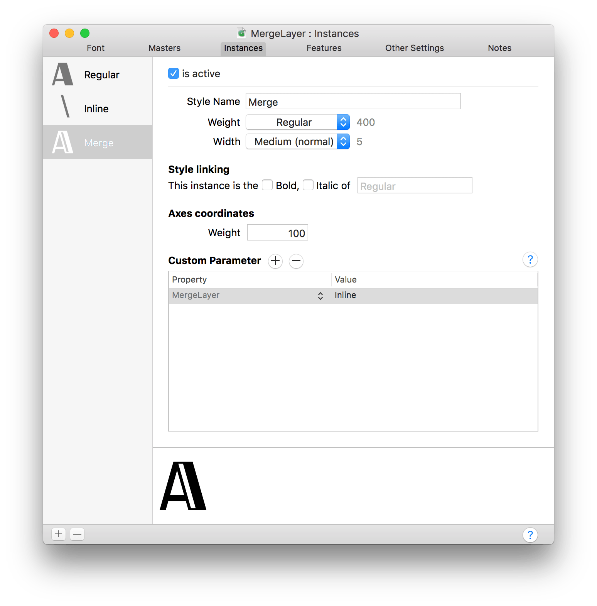

# Merge Layer
This plugins helps to combine to masters on export. E.g.: when you have a solid and a highlight layer and you like to have a font that combines both. 
The highlight layer with the solid layer in the background:

The Merged instance uses the coordinates from the solid masters and has a Custom Parameter "MergeLayer" with the value of the name of the "highlight" master:

### Requirements

The plugin needs Glyphs 2.6 or higher. I assume it will not work in earlier versions.

### License

Copyright 2019 Georg Seifert (@schriftgestalt).

Licensed under the Apache License, Version 2.0 (the "License");
you may not use this file except in compliance with the License.
You may obtain a copy of the License at

http://www.apache.org/licenses/LICENSE-2.0

See the License file included in this repository for further details.